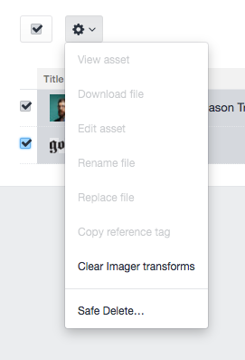
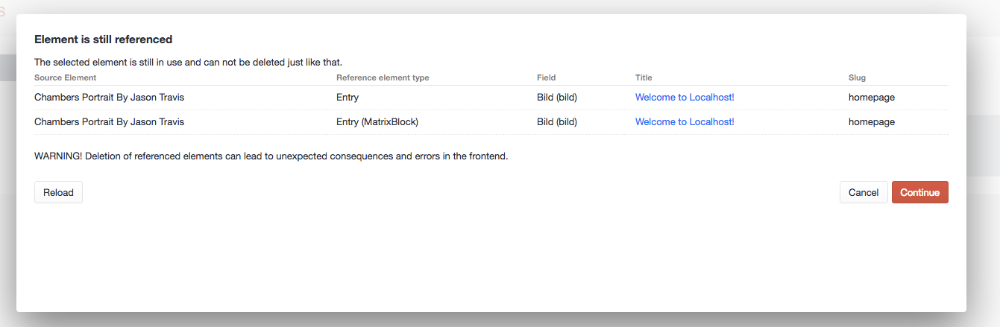

# Safedelete plugin for Craft CMS 3.x

## In Development - do not use!

Delete elements without breaking relations

SafeDelete enables you to delete elements without the danger of breaking relations with other elements and potentially
breaking frontend user experience and even introduce crashes to your site. 

If you try to delete an element which is still used you will be informed that the element is still referenced and it
delivers you also a list of elements where it is referenced.

For now the safe delete only works via the element index as an element action.
In future release this should also work while in the edit view of an element.

## Support
 - craft\fields\Assets
 - craft\fields\Entries
 - fruitstudios\linkit

## Waiting for support
Other 3th party plugins
https://docs.craftcms.com/v3/reference-tags.html#parsing-reference-tags

## Demo

